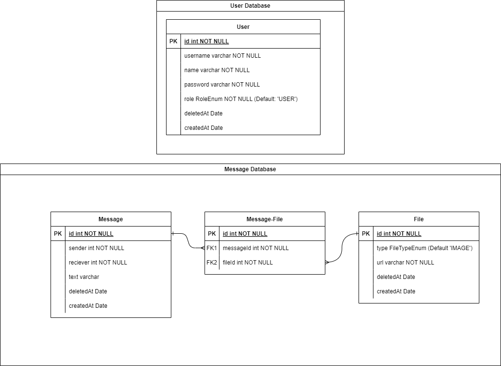

# Restful Messaging App
A microservice architecture Nest.js app handling all required APIs for a messaging application

## Documentation
### Entity Relation Diagram

### Component Based Architecture

## Microservices

all the microservices in this repository use EditorConfig to standardize text editor configuration. Visit [editorconfig.org](https://editorconfig.org) for details.

### User microservice
