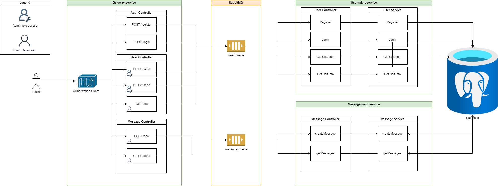

# Restful Messaging App

A microservice-based messaging application built using Nest.js. This project comprises multiple microservices that handle various API requests related to user management, messaging, and gateway services. The services communicate with RabbitMQ and store data in PostgreSQL.

## Overview

This repository contains three distinct microservices:
- **Gateway Service**: Acts as the entry point for the application, handling client requests.
- **Message Service**: Manages the message data and messaging-related operations.
- **User Service**: Manages user accounts and authentication.

Each service runs as an independent NestJS microservice and communicates through RabbitMQ. PostgreSQL serves as the data store.

### Entity Relation Diagram (ERD)


### Component-Based Architecture Diagram



## Microservices Breakdown

1. **Gateway** - Exposes the APIs for client-side consumption.
2. **Message** - Handles CRUD operations for messaging.
3. **User** - Manages user authentication and profile operations.

**Technology Stack**:
- NestJS framework for backend logic.
- PostgreSQL as the relational database.
- RabbitMQ as the message broker for microservices communication.

**Editor Configuration**:  
This project follows the EditorConfig standard to maintain consistency across code editors. More details can be found on the [EditorConfig website](https://editorconfig.org).


## Running the Project

### Running with Docker (Recommended)
The easiest way to run the project is using Docker Compose. Docker will set up PostgreSQL, RabbitMQ, and the three microservices automatically.


1. **Clone the repository**:
   ```bash
   git clone <your-repository-url>
   cd <your-repository-folder>
   ```

2. **Build and run services**:
   Use the following command to build and run the Docker containers:
   ```bash
   docker-compose up --build
   ```

   This will start:
   - **PostgreSQL** on port `5432`
   - **RabbitMQ** on ports `5672` (AMQP) and `15672` (Management UI)
   - **Gateway service** on port `3000`
   - **Message service**
   - **User service**

3. **Access RabbitMQ Management UI**:
   - Open a browser and go to `http://localhost:15672`.
   - Use the default credentials (username: `guest`, password: `guest`).
### Running Locally Without Docker

Alternatively, you can run the services manually using Node.js and npm:

1. **Install dependencies** for each microservice:
   ```bash
   # For gateway service
   cd gateway
   npm install

   # For message service
   cd ../message
   npm install

   # For user service
   cd ../user
   npm install
   ```

2. **Start the microservices** individually in separate terminals:
   - **Gateway service**:
     ```bash
     cd gateway
     npm run start:prod
     ```
   - **Message service**:
     ```bash
     cd message
     npm run start:prod
     ```
   - **User service**:
     ```bash
     cd user
     npm run start:prod
     ```
### Database Setup

Ensure that PostgreSQL is running, and you have two databases named `user` and `message` set up. These databases are required for the respective microservices to function correctly. Run any pending migrations for both databases before starting the services.

### Accessing Swagger API Documentation

You can explore and test the API using Swagger, which is available at:  
`http://localhost:3000/api`

## TODO / Next Release Checklist
Here are some potential enhancements and tasks for the next release of the messaging application:

1. **Testing**:
- Write unit tests for each service using Jest.
- Add integration tests for inter-service communication via RabbitMQ.

2.  **Error Handling**:
- Improve error handling across services to ensure proper logging and response structure.

3. **CI/CD Integration**:
- Set up continuous integration using GitHub Actions or CircleCI.
- Implement automated tests in the CI pipeline.